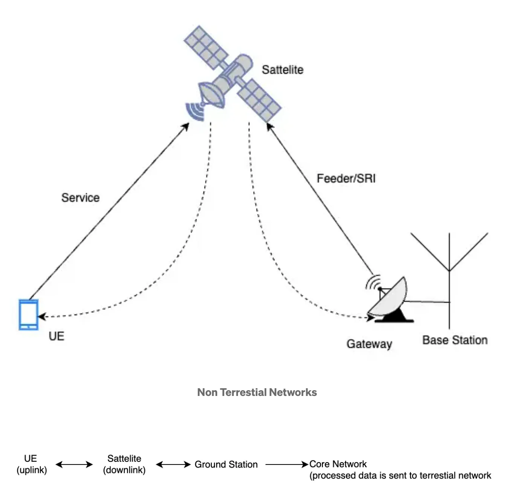

Introduction
****************

As 5G evolves, Non-Terrestrial Networks (NTN) are emerging as a key enabler for global, seamless connectivity — especially in regions beyond the reach of ground-based infrastructure. NTN brings the sky into the 5G equation, using satellite systems and high-altitude platforms to deliver coverage where traditional cell towers can’t reach.

These systems are crucial for:

- Connecting remote or rural areas
- Enabling communication in disaster zones
- Supporting mobile connectivity in aviation, maritime, and defense scenarios

Tyoes of Satellites in NTN 
=======================
1. **GEO (Geostationary Earth Orbit)**:~35,786 km above Earth, GEO satellites rotate in sync with the planet. They stay fixed in the sky relative to a point on Earth and offer continuous coverage to large areas — but with high latency (~500 ms round-trip).
2. **MEO (Medium Earth Orbit)** : Orbiting between ~8,000 km and 20,000 km, MEO satellites offer a middle ground in terms of coverage and latency. Used in systems like GPS.
3. **LEO (Low Earth Orbit)** : Flying at ~500–2000 km, LEO satellites provide low latency (~20–40 ms) and are ideal for real-time apps. But since they move quickly across the sky, a large constellation is needed for continuous service (e.g., Starlink, OneWeb).
4. **HAPS (High-Altitude Platform Systems)**: Though not satellites, HAPS operate in the stratosphere (~20 km), using balloons or drones to provide localized NTN coverage. They’re useful for disaster relief or targeted rural deployments.

Unlike terrestrial networks, NTN introduces new technical challenges:

- **Long signal propagation delays** (especially with distant satellites like GEO)

- **Doppler shifts** from fast-moving satellites (mainly LEO)

- **Timing and synchronization** issues due to variable satellite movement and distance

Fundamental Terminologies related to NTN
==================================

1. **User Equipment (UE)** : This refers to the end device — a smartphone, IoT sensor, modem, or any equipment that connects to the 5G network. In NTN, the UE must be adapted to handle higher delays, Doppler shifts, and sometimes even beam-switching events.

2. **gNB (Next Generation NodeB)** : The base station in 5G networks. In NTN, the gNB can be located on the ground (connected via a satellite link) or be part of a regenerative payload onboard the satellite. It handles radio access layer functions, including scheduling, HARQ management, and RLC/MAC control.

3. There are two primary types of NTN payloads:

a. **Transparent Payload** (also known as Bent-Pipe Payload or RF Repeater):These satellites work as simple relays or “bent-pipe” links. They forward RF signals to the ground without processing them. All protocol processing (decoding, scheduling, retransmissions) happens at the terrestrial gNB. Simpler and more cost-effective, these are commonly used in current LEO systems.

b. **Regenerative Payload** (also known as Non-Transparent Payload or Onboard Processing (OBP) Payload): Satellites equipped with onboard processing capabilities.It receives the signals, demodulates and decodes them onboard, processes the baseband data, and then re-encodes and modulates the signals before transmitting them to the users.This reduces latency, enables routing decisions in orbit, and allows for standalone operation when feeder links are unavailable.

4. **Feeder Link** : The backhaul link between the satellite and the ground gNB or gateway. It connects the satellite network with the core network.

5. **Service Link** : The access link between the satellite and the UE. This is the path over which user data, signaling, and control messages are exchanged.

6. **Propagation Delay** : Due to the vast distances in satellite communication, signal travel time is much higher than in terrestrial networks. This delay can impact processes like HARQ, scheduling, and synchronization.

7. **HARQ (Hybrid Automatic Repeat reQuest)** : A protocol mechanism that enhances data reliability. If a data block has errors, the UE or gNB requests a retransmission — but only incremental bits are resent to improve efficiency.

In NTN, HARQ is challenged by long delays. For instance, in GEO setups, RTT can exceed 600 ms, making it impractical to wait for ACK/NACK. This often requires tuning HARQ timers or disabling it altogether in certain links.

8. **Doppler Shift** : The change in frequency caused by the relative motion between the satellite and the UE. In low-altitude orbits (like LEO), the rapid movement causes significant Doppler shifts that must be compensated to avoid link failure.

9. **Beam Handover** : In NTN, especially with LEO constellations, UEs often move from one satellite beam to another. Beam handovers maintain continuous service as satellites orbit and change position in the sky

10. **Round Trip Time (RTT)** : The total time a signal takes to go from UE → satellite → gNB → and back. RTT affects everything from RACH to HARQ, buffer tuning, and scheduler responsiveness.

11. **cellSpecificKoffset** : Helps align UE timing during Random Access (RACH) by offsetting timing in the cell-specific configuration. It compensates for large NTN delays by shifting the UE’s reception and transmission timing.It ensures that the UE and gNB stay synchronized, even with satellite-induced propagation delays.

12. **Inter-Satellite Links (ISL)**: Communication links directly between satellites, allowing for more flexible routing and reduced reliance on ground stations.

Key Differences Between NTN and Terrestrial 5G
================================================

**Propagation Delay:**
Terrestrial 5G has delays around ~1–5 ms, while NTN can experience up to 400+ ms, especially with GEO satellites.

**Doppler Shift:**
Minimal in ground networks but significantly high in LEO-based NTN systems due to satellite movement.

**Mobility:**
Terrestrial handovers happen between nearby cells; NTN mobility involves tracking beams or switching between satellites.

**Infrastructure:**
5G networks rely on ground towers and fiber, while NTN uses satellites, feeder links, and gateways.

**Stability:**
Terrestrial links are stable while NTN links may vary with atmospheric conditions and satellite dynamics.

