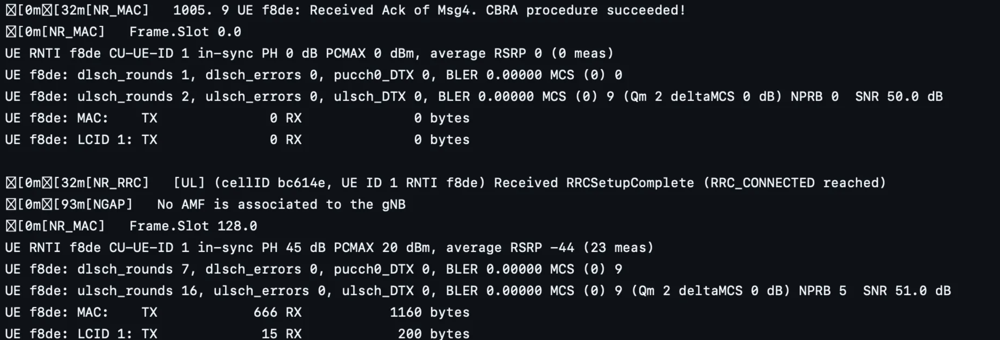
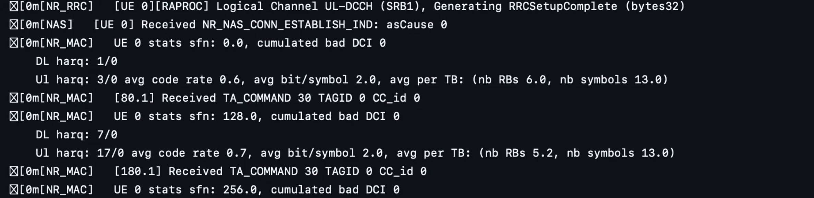

OAI NTN Part 1: Breaking the Source Code
=========================================

**Author: Megha Koranga**

Continuing our exploration of Non-Terrestrial Networks (NTN), this second part of the series delves into the technical implementation within the 5G network architecture. We will examine the code flow and the necessary extensions made to the gNB and UE software to enable communication with satellites and other non-terrestrial platforms. This will involve looking at how standard procedures are modified to account for NTN-specific characteristics.

For a clearer understanding of the sequence and interaction between layers, we’ve created a simplified flowchart showing the step-by-step flow of how NTN support is integrated into the OAI stack — from gNB initialization to timing adjustments and message scheduling.

For better visibility, you can access a clearer version of the flowchart using the following link:

Link: `https://app.diagrams.net/#G1pdG863MVB1PmqTQG2HVdMAC9hXP82mJm#%7B%22pageId%22%3A%22KzjFfqPiEhOPBe0r8-R2%22%7D <https://app.diagrams.net/#G1pdG863MVB1PmqTQG2HVdMAC9hXP82mJm#%7B%22pageId%22%3A%22KzjFfqPiEhOPBe0r8-R2%22%7D>`_

.. image:: photos/ntn_codeflow_oai.svg
  :width: 1000
  :alt: Alternative text

Flowchart showing the step-by-step flow of how NTN support is integrated into the OAI stack — from gNB initialization to timing adjustments and message scheduling.

Step-by-Step Breakdown of the NTN Flowchart
============================================

gNB
----

**Step 1: RCconfig_nr_macrlc(cfg) – MAC & RLC Layer Configuration Entry Point**  
This is the first major configuration function called after the basic system initialization. It sets up the gNB’s MAC and RLC layers by reading the configuration from the config interface.

**Step 2: nr_mac_config_scc() – Applying NTN Offsets in MAC**  
This function takes the serving cell config (scc) and applies timing offset calculations that are critical for NTN. 

Calls ``get_NTN_Koffset()`` to calculate delay-based offsets:  
- GEO → 478, LEO → 40  

- Sets scheduling delays for Msg2, Msg4, and HARQ.  

``[NR_MAC] Candidates per PDCCH aggregation level on UESS: L1: 0, L2: 2, L4: 0, L8: 0, L16: 0
These MAC logs show that the MAC scheduler is initialized and now considers NTN-specific timing shifts.``

**Step 3: prepare_scc() – Finalizing Serving Cell Config (RRC Layer)**  
It’s part of the early setup flow — and it’s crucial because this is where the gNB learns how to behave in terms of frequency, bandwidth, and timing.Constructs the ``ServingCellConfigCommon`` used in RRC to build SIBs (System Information Blocks). This is where the gNB gets ready to broadcast configuration to UEs.

- Checks ``scc->ext2->ntn_Config_r17``, which signals that NTN mode is enabled. 

- When true, it enables support for additional timing parameters and satellite-specific features.

- It ensures memory is allocated for extended SIBs (v1700).

**Step 4: get_SIB1_NR() – Populating NTN-Specific Fields in SIB1**  
- Check if the gNB is operating in an NTN band using ``is_ntn_band(band)`` band=254 and is_ntn_band() controls whether SIB1/SIB19 are filled with satellite parameters 

- Allocate memory for extended SIB1 versions (v1610, v1630, v1700) as required by 3GPP Release 17

- NR_UE_Timers And Constants values are assigned(ms) t300=t301=t310=t319=2000,n310=10,n311=1,t311=3000

- Set the ``cellBarredNTN_r17`` flag to notBarred, indicating that the cell supports NTN UE.

These changes ensure that all satellite-related parameters — like orbit type, timing advance support, and satellite position — are made available to the UE early in the connection process.

``[NR_RRC] SIB1 freq: offsetToPointA 5
This log confirms that the frequency domain resource parameters in SIB1 are set - specifically, offsetToPointA, which defines the starting point of the carrier grid.``

**Step 5: Control Returns to `RCconfig_nr_macrlc(cfg)`**  
Now , all NTN-specific configuration — including SIB1/SIB19 values, timing adjustments, and band identification — has been passed from RRC to MAC.

``if (IS_SA_MODE(get_softmodem_params()))
Checks if the system is running in Standalone (SA) mode``

and If ``ntn_Config_r17`` is present:

- Calls ``nr_mac_configure_sib19()`` to schedule SIB19, which includes:

- Satellite position and velocity

- Timing advance and Doppler compensation data

``[HW] No connected device, generating void samples...``

**Step 6: gNB_dlsch_ulsch_scheduler() – Main Downlink+Uplink Scheduling Function, called every slot.**  
- SIB1 / SIB19 scheduling

- PRACH (Msg1) resource reservation using ``NTN_Koffset``.

- Calls schedule_nr_sib19() to broadcast satellite parameters

- Ensures UE Msg1 timing aligns with the long delay of GEO/LEO satellites

As ``gNB_dlsch_ulsch_scheduler()`` runs continuously in the slot loop, it checks if any UE has initiated random access — and then triggers the required message handling steps.

- ``get_feasible_msg3_tda()`` is called-

``[NR_MAC] 414.4 UE RA-RNTI 003d TC-RNTI d7f9: Activating RA process index 0
[NR_MAC] Adding new UE context with RNTI 0xd64f``

UE has sent a Random Access Preamble (Msg1)
The gNB has received Msg1 and now starts the Random Access process

From now on, all MAC-layer decisions (buffer handling, scheduling, etc.) are tracked for this UE This happens just before Msg2

**Step 7: Uplink Preprocessor – nr_ulsch_preprocessor()**  
After the UE context is created, the gNB calls ``nr_ulsch_preprocessor()`` to schedule uplink data.

For NTN, the function applies an adjusted K2 value using ``get_NTN_Koffset()``.GEO : ``K2 =484``, LEO : ``K2 =46``

k2 defines the UL scheduling delay between DCI grant and PUSCH transmission

``NR_MAC]   UE f8de: Msg3 scheduled (415.3 TDA 0)
[NR_MAC]  UE d7f9: 415.3 Generating RA-Msg2 DCI``

At slot 415.3, the gNB schedules Msg3 for UE ``f8de`` while simultaneously generating Msg2 for UE ``d7f9``.

This overlap is possible because OAI uses the calculated K2 delay (from ``get_NTN_Koffset()``) to shift Msg3 far enough into the future — ensuring that it arrives correctly even in the presence of GEO/LEO satellite delays.

**Step 8: Msg3 Received and Msg4 Scheduling Begins**

``[NR_MAC]   507. 3 PUSCH with TC_RNTI 0xd64f received correctly
[NR_MAC]   Activating scheduling Msg4 for TC_RNTI 0xd64f (state WAIT_Msg3)
[NR_RRC]   Decoding CCCH: RNTI d64f, payload_size 6``

The gNB successfully received Msg 3, confirmed by ``[NR_MAC] PUSCH with TC_RNTI 0xd64f received correctly.``

It then transitions the UE to ``WAIT_Msg4`` state and begins preparing Msg4.
At the same time, ``[NR_RRC] Decoding CCCH`` indicates that the gNB is now reading the RRC Connection Request from the UE — the final step before establishing full RRC connection.

**Step 9: Continuous Loop After Msg3**  
Once Msg3 is received, the gNB enters a continuous loop where it calls the ``gNB_dlsch_ulsch_scheduler()`` function every slot. Within this loop, it keeps checking and preparing for upcoming events-Msg4 scheduling, uplink timing, and measurement reporting.

This loop also repeatedly triggers functions like ``nr_ulsch_preprocessor()`` and ``nr_csi_meas_reporting()`` as part of regular slot-based processing.

``[NR_RRC] [DL] Send RRC Setup``

This log confirms that the Msg4 content has been prepared for the UE
It’s now ready to be delivered via PDSCH in Msg4.

**Step 10: Msg4 Scheduling Phase**  
After looping through the scheduler, the gNB eventually builds Msg4 using ``nr_generate_Msg4_MsgB()`` and calculates the expected ACK/NACK feedback time using ``nr_acknack_scheduling()``.
The feedback slot is again shifted using ``NTN_gNB_Koffset()`` to compensate for satellite delay.
Finally, the gNB logs that Msg4 is sent and waits for the UE’s acknowledgment

``[NR_MAC] UE dGenerate Msg4: feedback at  557. 2, payload 201 bytes,
 next state nrRA_WAIT_Msg4_MsgB_ACK``

UE
---

**Step 1: apply_ntn_config() Called from UE_thread() (Repeatedly)**  
Inside ``UE_thread()`` (in ``nr-ue.c``), the function ``apply_ntn_config()`` is called repeatedly during the main loop.

It checks and applies satellite-related timing configurations for the UE, such as orbit type and delay offsets, based on whether NTN is active.

This step ensures the UE keeps adjusting itself per-slot for accurate timing under satellite conditions like GEO or LEO.

``[NR_RRC]   Found SIB19``

**Step 2: SIB19 Decoding and NTN Configuration Transfer**  
This marks the point where the UE officially detects it’s in an NTN-enabled cell. After successfully decoding SIB19 the function ``process_msg_rcc_to_mac()`` is triggered to send NTN-related configuration — such as orbit type and TA adjustments — from RRC down to the MAC layer.

**Step 3: nr_rrc_mac_config_other_sib() – Applying SIB19 and Starting RA (NTN-Specific)**  
This function applies the NTN configuration received via SIB19 into the UE's MAC layer.

It updates ``ntn_Config_r17``, computes timing advance using ``configure_ntn_ta()``, and transitions the UE to ``UE_PERFORMING_RA`` — meaning it’s now ready to start Random Access using satellite-aligned timing.

**Step 4: configure_ntn_ta() – Computing Total UE Timing Advance for NTN**  
- The function ``calculate_ue_sat_ta()`` is called which computes the UE-to-satellite signal delay using the 3D positions of both the UE and the satellite.

- It returns ``238.74 ms``, which becomes part of the UE’s total timing advance.

- This value ensures that Msg3 is transmitted early enough to reach the gNB precisely when expected, even in high-orbit NTN conditions like GEO.

**Step 5: schedule_ntn_config_command() – Delivering NTN Timing to PHY Layer**  
- Once all NTN timing values are computed in MAC, the function ``schedule_ntn_config_command()`` prepares a special FAPI PDU that passes this information to the PHY layer.

- This ensures the physical layer can align uplink transmissions (Msg3) — with the expected satellite delay.

- It includes the full timing advance, TA drift, and Koffset scheduling offset, enabling slot-accurate scheduling for LEO/GEO scenarios.

**Step 6: nr_ue_scheduled_response_dl() – Applying NTN Timing at PHY Layer and configure_ntn_params() – Final PHY Configuration**  
- At the final step of NTN setup, the function ``nr_ue_scheduled_response_dl()`` processes the timing configuration message from MAC.

- When it sees ``case :FAPI_NR_DL_NTN_CONFIG_PARAMS``, it calls ``configure_ntn_params()``, which loads all satellite-specific timing values into the PHY layer.

- These include the combined delay (``ntn_total_time_advance_ms``) and drift correction, enabling the UE to send uplink messages -Msg3 and PUCCH precisely aligned with gNB expectations.

**Step 7(a): UE Starts 4-Step Random Access with NTN Adjustments**  
``apply_ntn_config()`` is called again from within the per-slot processing loop in the UE PHY.

``[MAC] Initialization of 4-Step CBRA procedure
[NR_MAC] PRACH scheduler: Selected RO Frame x, Slot 9, Symbol 0, Fdm 0``

After all NTN configuration is applied, the UE begins Random Access using the 4-step CBRA procedure.

It selects a PRACH occasion ([NR_MAC] PRACH scheduler...) for Msg1 transmission, fully adjusted using satellite timing parameters.

When preparing Msg3, the UE ``usesGET_DURATION_RX_TO_TX()`` to compute how many slots to wait between DL reception and UL transmission — ensuring all uplink messages align with gNB expectations

**Step 7(b): UE Msg1 Sent → Msg2 Received and TA Applied (NTN Flow)**  

``[PHY] PRACH [UE 0] in frame.slot -- placing PRACH in position, Msg1/MsgA-Preamble
[PHY] RAR-Msg2 decoded
[NR MAC] [UE 0] Found RAR with the intended RAPID 56
[MAC] Received TA command 31``

- After transmitting Msg1, the UE enters its per-slot loop again (apply_ntn_config())and receives Msg2, confirmed by ``[PHY] RAR-Msg2 decoded`` and ``[NR MAC] Found RAR with RAPID 56.``

- The UE calculates the timing for Msg3 using ``GET_DURATION_RX_TO_TX()`` and applies the TA command received in Msg2.

- ``apply_ntn_config()`` is invoked repeatedly to keep the PHY layer updated with the latest satellite delay and drift, especially important in fast-moving LEO orbits.

**Step 7(c): Msg3 Transmission — NTN Timing Fully Applied**  

``Log: [NR MAC] [RAPROC] [163.3] RA-Msg3 transmitted``

- At slot 163.3, the UE successfully transmits Msg3, as confirmed by the ``[RAPROC] RA-Msg3 transmitted`` log.

- Then function ``nr_Msg3_transmitted()`` is called to finalize the transmission, recording the total satellite-based delay (``ta_common_ms``) — 477.48 ms for GEO, and 37.66 ms for LEO.

- The timing was calculated using the combined result of SIB19, satellite ephemeris, and the Msg2 TA command.

- With Msg3 sent, the UE continues calling ``apply_ntn_config()`` to stay aligned for Msg4 and ACK/NACK scheduling.

**Step 7(d):  Final Step: Msg4 Acknowledged — RA Procedure Successful**  

``On GNB
[NR_MAC]  UE : Received Ack of Msg4. CBRA procedure succeeded!
On UE 
4-Step RA procedure succeeded. CBRA: Contention Resolution is successful.``

- Once Msg3 is transmitted and Msg4 is received, the UE sends an ACK using PUCCH.

- The gNB receives this ACK at some slot and confirms the completion of the contention-based RA procedure.

- The UE logs that contention resolution succeeded — meaning no collisions occurred — and the UE now transitions to the next stage of connection setup.

This moment marks the **successful hand-in-hand synchronization between UE and gNB over satellite**, despite large and asymmetric delays.

**Step 8 : Post-RA: UE Begins RRC Setup Completion**

``[NR_RRC] [UE 0] [RAPROC] Logical Channel UL-DCCH (SRB1), Generating RRCSetupComplete (bytes32)``

- After the 4-step Random Access procedure finishes, the UE sends the `RRCSetupComplete` message over the UL-DCCH channel using SRB1.

- This message confirms the establishment of the RRC connection with the gNB and finalizes the UE’s admission into the network.

- While this is happening, ``apply_ntn_config()`` continues looping each slot to maintain NTN timing precision — ensuring uplink and downlink remain correctly aligned over the satellite link.

Data Exchange Between UE and gNB
=================================

gNB(for GEO)

gNB log output shows successful Msg4 acknowledgment, RRC connection establishment, and early uplink/downlink activity.

The logs confirm the UE is in-sync and actively exchanging MAC-layer messages with the gNB, with all NTN timing offsets correctly applied.

UE(for GEO)

This concludes Part II of the NTN blog series, where we examined the overall code flow enabling Non-Terrestrial Network (NTN) support in OpenAirInterface.
Through both gNB and UE perspectives, we walked through key components such as SIB19 processing, NTN-specific timing advance computation, and synchronization across the 4-step Random Access Procedure.

The included flowchart offers a consolidated view of this interaction, highlighting the key function calls and log traces involved in establishing NTN-aware connectivity.