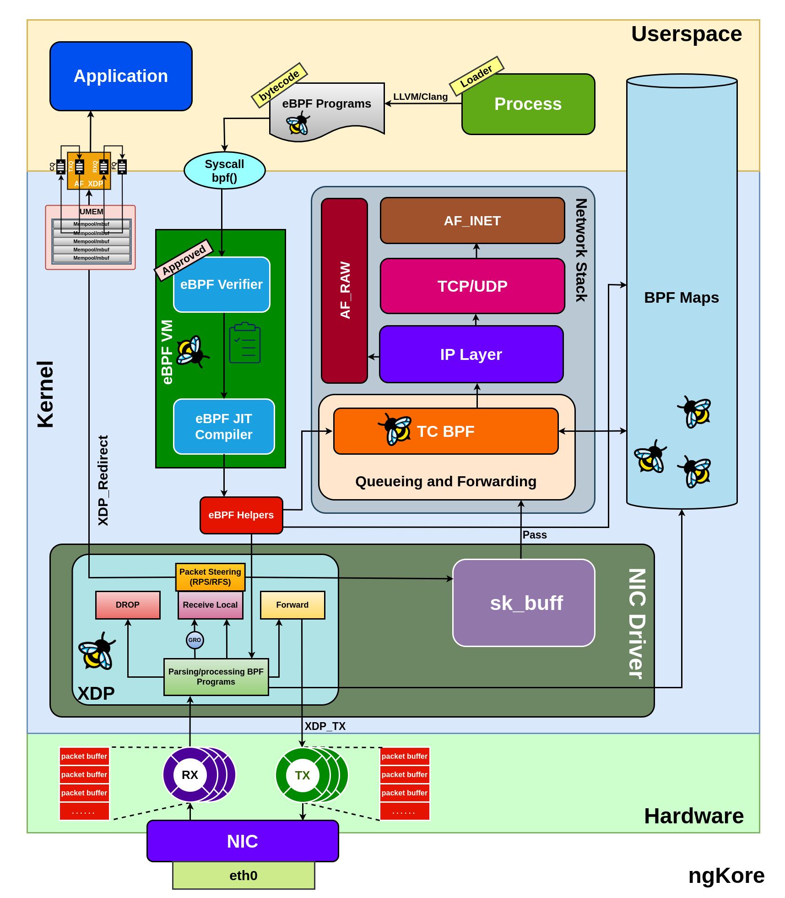
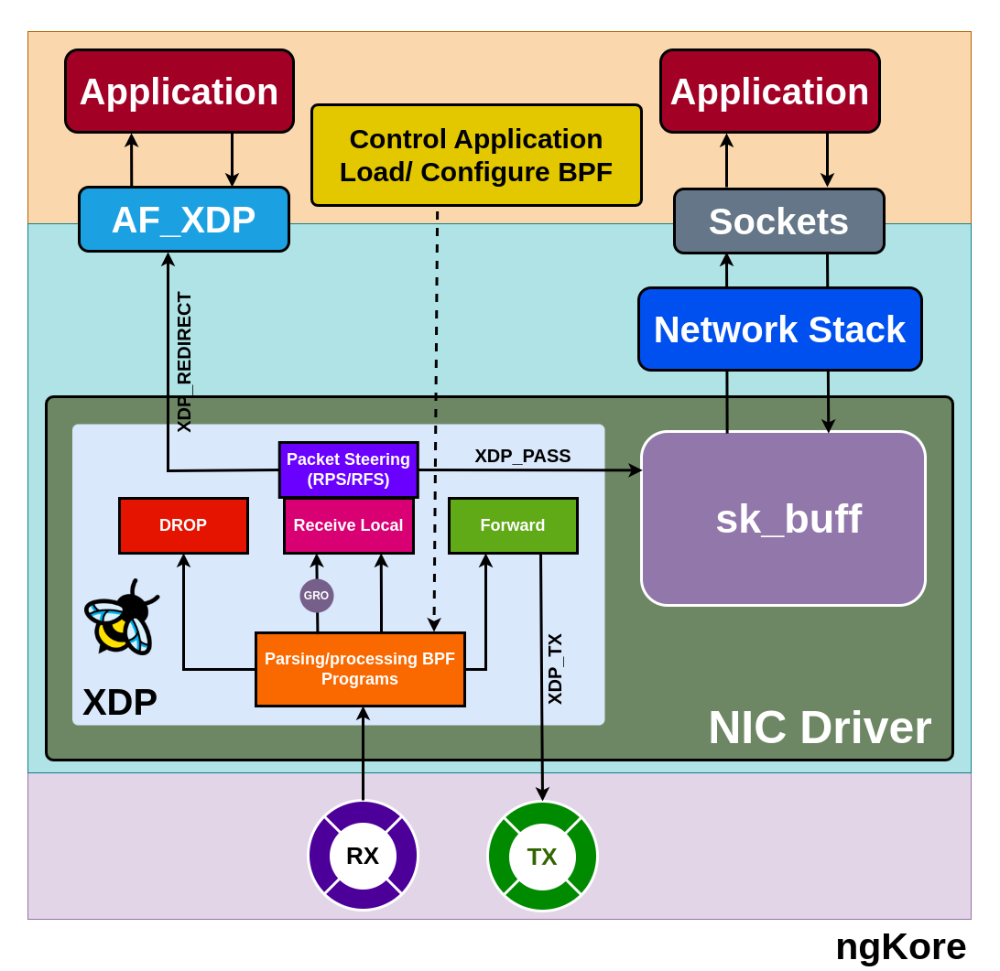
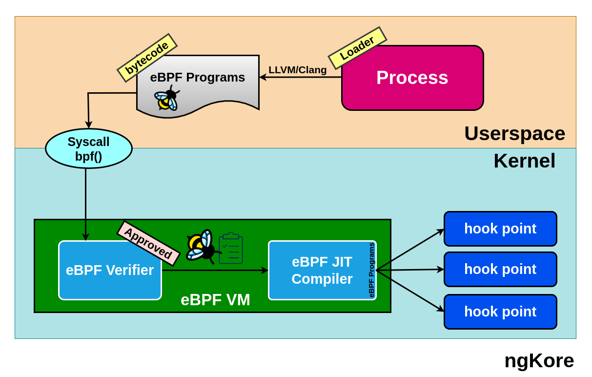
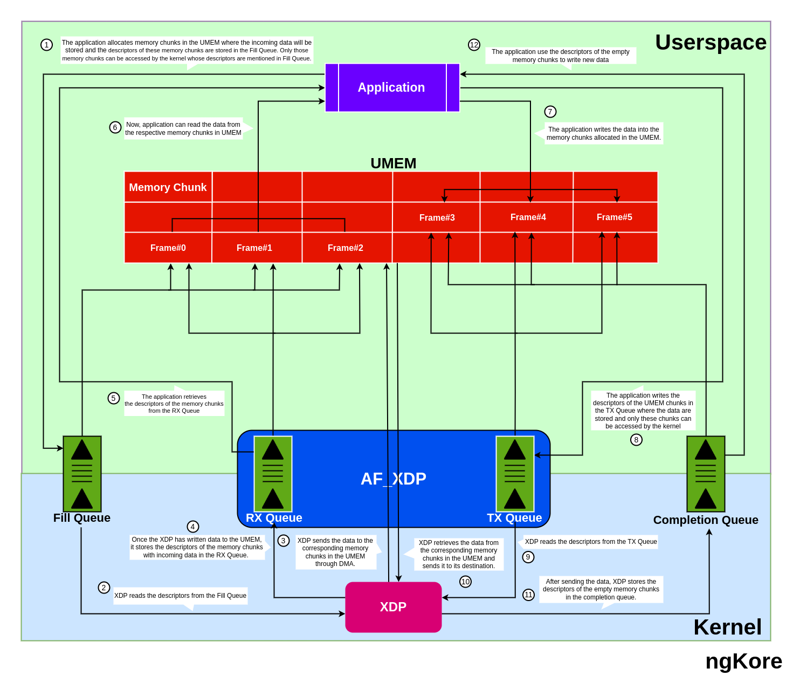

AF_XDP
****************

AF_XDP(*Address Family - eXpress Data Path*) socket is a high-performance mechanism for bypassing the traditional kernel network stack, enabling userspace applications to process packets directly. It uses eBPF programs at the XDP hook and shared userspace memory(*UMEM*) to efficiently transfer packets between the NIC and userspace, reducing latency and improving throughput for packet processing tasks.

Hardware Requirements
==================

To implement XDP and AF_XDP effectively, certain hardware-level features and capabilities should be present in your system:

1. **NIC compatibility** -  Ensure the NIC supports the XDP and AF_XDP features.

2. **Driver support** -  XDP support depends on the network driver. Currently, it is supported by Broadcom's bnxt, Cavium's thunderx, Intel's ixgbe, ixgbevf, and i40e, Mellanox's mlx4 and mlx5, Netronome's nfp, and Qlogic's qede drivers.

3. **Hardware queue support** -  XDP requires the NIC to support multiple hardware queues. The number of queues required depends on the number of CPU cores available for packet processing.

Components of XDP System
==================

The Major components of the XDP system are:

1. **XDP Driver hook** -  It is the main entry point where the eBPF programs are implemented at the network driver level. The main focus is to execute the XDP program at the earliest possible time after a packet is received from the NIC hardware.

2. **eBPF VM** -  It is a lightweight, register-based VM responsible for executing the bytecode of the XDP program. The eBPF VM also performs JIT(*Just-In-Time*) compilation to increase performance by converting the bytecode to native machine code for the specific CPU architecture.

3. **BPF Maps** -  These are key-value stores that serve as the primary communication channel between the eBPF programs running at different locations in the kernel and also between the kernel and the userspace applications. BPF maps can be used for various purposes, such as storing configuration data, packet statistics, connection tracking, and flow state information. 

4. **eBPF Verifier** -  The eBPF verifier is a critical component that statically verifies eBPF programs before they are loaded into the kernel and checks whether the program bytecode is safe or not. It checks the program for safety and correctness, ensuring that it doesn't have any loops, doesn't access out-of-bounds memory, and adheres to other safety constraints.

5. **eBPF Loader** -  The eBPF loader is a user-space tool, such as 'iproute2', that loads the eBPF program into the kernel.

Packet Flow
=======

**From NIC to the Application**
----------------------

1. Packets arriving at the NIC are temporarily stored in its internal memory(*implemented using SRAM, or dedicated DRAM*).

2. NIC performs normal packet processing (*e.g., error checking, basic filtering*), creates packet descriptors (*packet size + buffer address*), and places them in the RX ring buffer.

3. The packet descriptors are passed onto the XDP hook of the NIC driver, where the eBPF program processes the packets fetched from the NIC internal memory and takes decisions based on the eBPF program. It decides whether to pass the packet to an AF_XDP socket or continue through the kernel network stack

4. If the eBPF program decides to pass the packet to an AF_XDP socket, the packet data is DMA-mapped from the NIC's internal memory into a region of user memory (*UMEM*), shared between the kernel and user space.

5. First, XDP reads the descriptors of the empty memory chunks in the UMEM region from the Fill Queue then DMA-mapped the data packets from the NIC's internal memory to the provided memory chunks and then stores the filled memory chunks’ descriptors into the RX queue.

6. The application retrieves the descriptors of the memory chunks from the RX Queue and processes the packets.

**From Application to the NIC**
----------------------

1. The application prepares packets for transmission, storing them in designated memory chunks within the UMEM (*Userspace MEMory*) region, and places their corresponding descriptors in the TX (*transmit*) queue associated with the AF_XDP socket.

2. XDP retrieves the descriptors from the TX queue and transfers the data packets from the respective memory chunks to the NIC's internal memory using DMA (*Direct Memory Access*).

3. Subsequently, the descriptors for the now-empty memory chunks are added to the UMEM's Completion queue.

4. Upon possessing the packet descriptors, XDP determines the appropriate destination for the packets. It forwards the descriptors to the NIC's TX ring, from which the packets are transmitted to their intended destinations.