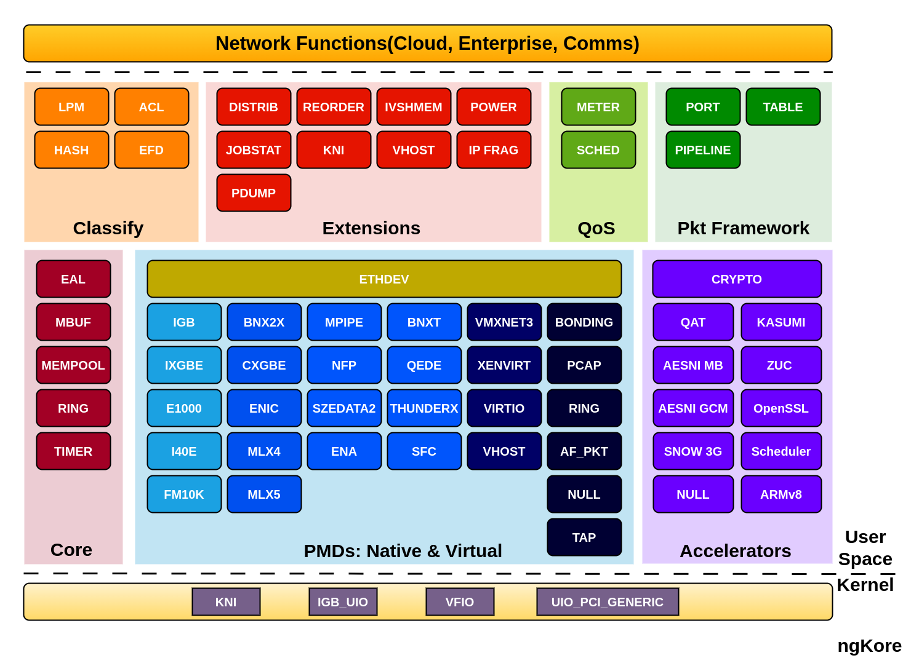
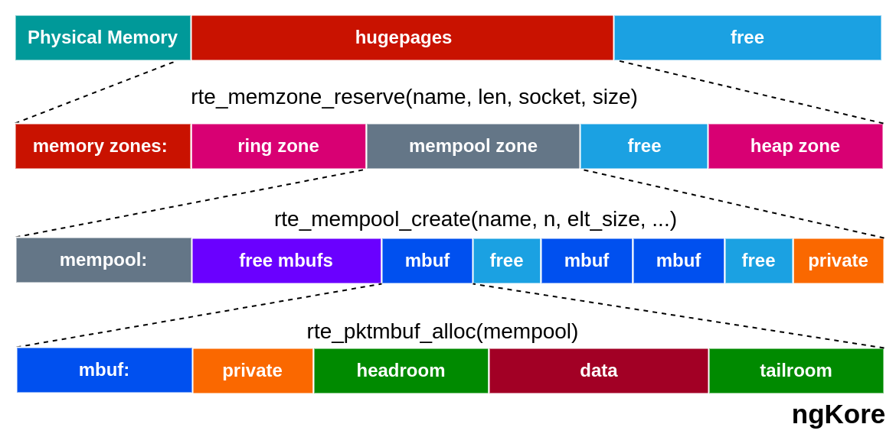
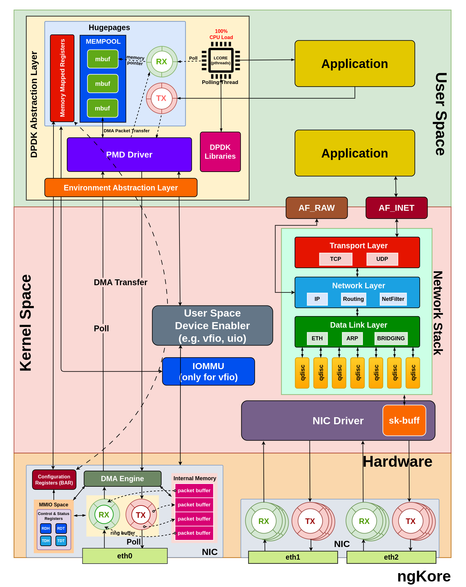
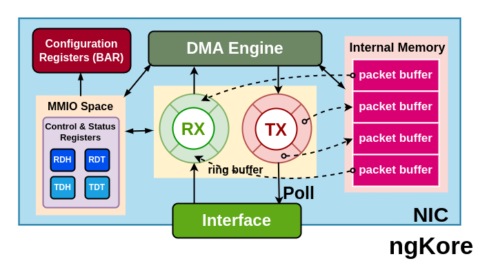
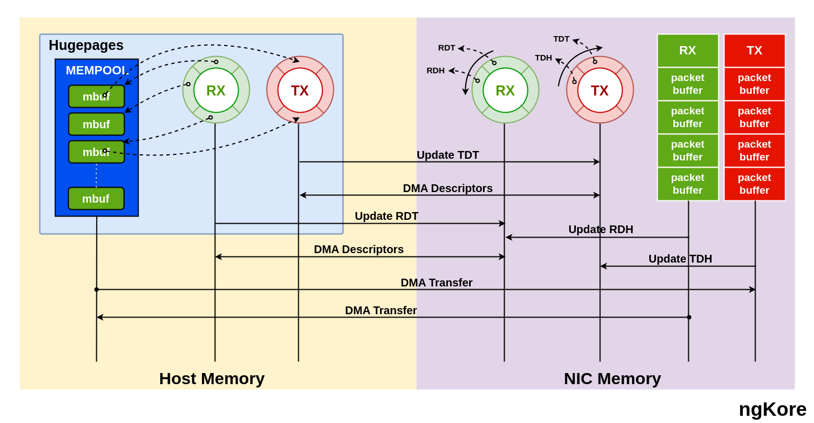
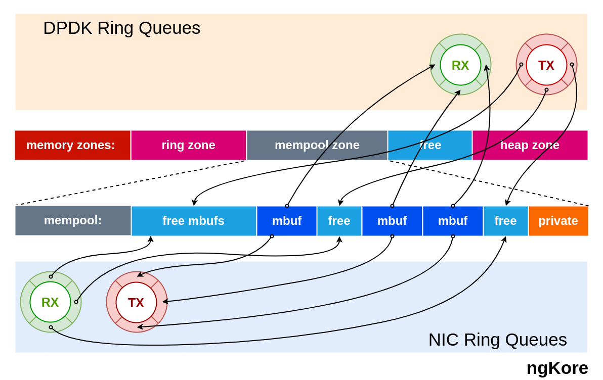

DPDK
****************

DPDK(*Data Plane Development Kit*) is a toolkit or a set of libraries and PMD drivers that help us to attend the high-performance packet processing at the application level by bypassing the traditional kernel network stack and directly interacting with the NIC hardware using the userspace driver, which helps achieve low latency and high throughput performance. 

However, in scenarios where specific packets need network stack processing, it is crucial to implement a user space network stack to handle those requirements efficiently. 

Hardware Requirements
==================

To implement DPDK, there are several hardware-level requirements and configurations necessary to ensure the proper functioning and high-performance packet processing. These are:

1. **Compatible NIC(Network Interface Card)** -  DPDK requires a `[compatible NIC] <https://core.dpdk.org/supported/#nics>`_ that supports the required features for efficient packet processing. 

2. **Detaching NIC from the kernel driver** -  Before using a NIC with DPDK, the NIC must be detached from the associated kernel network driver. This is necessary to allow the DPDK userspace application to have direct control over the NIC without interference from the kernel.

3. **Attaching NIC to the appropriate DPDK driver** -  After detaching the NIC from the kernel driver, the NIC needs to be bound with the appropriate DPDK-compatible driver, such as vfio-pci, igb_uio, or uio_pci_generic. These drivers enable direct access to the NIC from the DPDK userspace application and reduce the overheads associated with context switching, interrupt handling, and memory management.

4. **CPU and NUMA(Non-Uniform Memory Access) considerations** -  To avoid contention with other system processes, it is best practice to assign dedicated CPU cores to the DPDK application. This can be achieved using CPU pinning or isolation. Also, the memory allocated for the DPDK application should be from the same NUMA node where the CPU cores and NICs are located, this will minimize the latency and maximize the performance.

5. **Hugepages** -  A portion of memory should be reserved as hugepages during boot for DPDK to use for memory allocation. This helps to use larger page sizes, reducing the overheads associated with managing memory using smaller page sizes. Using a large continuous memory area with hugepages, it also reduces data fragmentation and other memory management operations such as TLB, lookups, etc.

6. **IOMMU(Input-Output Memory Management Unit) support** -  For systems that use VFIO-PCI drivers, IOMMU support in the BIOS and kernel is needed. IOMMU provides memory isolation and protection for devices, allowing secure direct access to the NIC hardware from the userspace application.
IOMMU provides a short path for devices to get access only to a well-scoped physical device memory area that corresponds to a DPDK application.

Components of DPDK Abstraction Layer
==================

In addition to the PMD driver, DPDK comprises essential libraries that enable high-performance packet processing. Most importantly, the core library provides abstractions for efficient packet handling. Key components include the Environment Abstraction Layer (*EAL*), Memory Buffer (*MBUF*), Ring Buffer (*RING*), Memory Pool (*MEMPOOL*), and Timer libraries.

.. image:: photos/AL.png
  :width: 800
  :alt: Alternative text

1. **EAL** - The EAL is responsible for setting up the runtime environment for the DPDK application, and providing a generic interface between the DPDK application and the underlying OS for accessing hardware and memory resources.

2. **MBUF** - It manages memory buffers for packet data and associated metadata. MBUFs are allocated from DPDK memory pools and used to store packet data throughout the processing pipeline.

3. **RING** - RING is used for implementing receive (*RX*) and transmit (*TX*) ring buffers, which are crucial for managing packet descriptors and ensuring smooth packet flow between the NIC and the DPDK application.

4. **MEMPOOL** - This is the pre-allocated, fixed-size memory pool region inside the hugepages. It is used for allocating MBUFs and other objects that require consistent and fast memory access.

Packet Flow
=======

**From NIC to the Application**
----------------------

1. Packets arriving at the NIC are temporarily stored in its internal memory(*implemented using SRAM, or dedicated DRAM*).

2. NIC processes the packet(*e.g., error checking, basic filtering*), creates packet descriptors(*packet size + buffer address*), and placed them in the RX ring buffer.

3. The RX ring is managed by the PMD(*Poll Mode Driver*) driver using 2 registers i.e. Receive Descriptor Head (*RDH*) and Receive Descriptor Tail (*RDT*) registers. These registers are control and status registers stored in MMIO space(*memory-mapped I/O*).

4. NIC uses DMA(*Direct Memory Access*) engines to transfer packet data directly from its internal storage to a pre-allocated mbuf(*memory buffer*) in the host memory.

5. The NIC's MMIO space, which includes control and status registers, is mapped into the host memory address space(*mempool*) using the BAR(*Base Address Register*). The PMD driver can access these registers to control and configure the NIC.

6. Initially, both RDH and RDT register point to the same position in the RX ring. Once the packet arrived in the NIC, the packet descriptor is stored in the region specified by the RDH register and gets incremented for every new packet descriptor added.

7. The PMD driver, running on a dedicated CPU core, constantly polls the RX ring for new descriptors from the position pointed to by the RDT register. When a descriptor is found, the DPDK application retrieves the associated mbuf and processes the packet data, and increments the RDT register by 1 to point to the next packet descriptor in the RX ring.

8. The PMD driver continues to poll and process packet descriptors as long as the RDT register points to a different location than the RDH register.  When the RDT and RDH are equal, it means that the RX ring is empty, and the PMD driver has processed all available packet descriptors.

9. The PMD driver is used to poll packets directly from the RX ring of the physical NIC, without involving the CPU. The PMD driver uses a polling mechanism to continuously check the RX ring for incoming packets and transfers them to the corresponding RX queue in the DPDK NIC abstraction layer using DMA. 

10. The PMD driver initializes the descriptor rings and mbuf pools in the huge pages and uses them to keep track of the packet. This method reduces the overhead associated with the CPU interrupts, but can also consume a significant amount of CPU resources. PMD driver is also responsible for calling the EAL functions.

11. The pThreads are typically used in multi-core systems, where each pThread is pinned to a dedicated CPU core and is responsible for polling one or more DPDK NIC queues for incoming packets. The pThreads continuously poll the RX queues for new packets and process them when they are received.

12. pthreads poll the data packets from the mbuf region of the mempool pointed by the packet descriptors in the RX ring of the DPDK abstraction layer, process them and send them to the application.

**From Application to the NIC**
----------------------

1. The application prepares the packet for transmission, storing it in a mbuf allocated from the DPDK memory pool, typically configured using hugepages.

2. The PMD driver running on a dedicated CPU core retrieves the packet data from the mbuf and creates a descriptor containing metadata such as packet size, and buffer address.

3. The PMD places the descriptor in the TX ring, which is located in the mempool.

4. PMD driver places the packet descriptor in the location pointed by the TDT(*Transmit Descriptor Register*) register and updates it to point to the next descriptor.

5. The TDT and TDH registers are located in the NIC's MMIO(*memory-mapped I/O*) space, which is accessible to the PMD driver through the BAR(*Base Address Register*).

6. The NIC continuously polls the TX ring by checking the TDH(*Transmit Descriptor Head*) register.

7. When the NIC detects a new descriptor at the TDH register, it retrieves the associated data packet from the mbuf of the host memory and updates the TDH register to point to the next location.

8. The NIC uses DMA(*Direct Memory Access*) engines to transfer packet data from the mbuf in the host memory to its internal storage.

9. The NIC performs any necessary processing tasks, such as adding checksums or VLAN tags, before transmitting the packet.

10. Finally, the NIC transmits the packet data through the appropriate network interface.