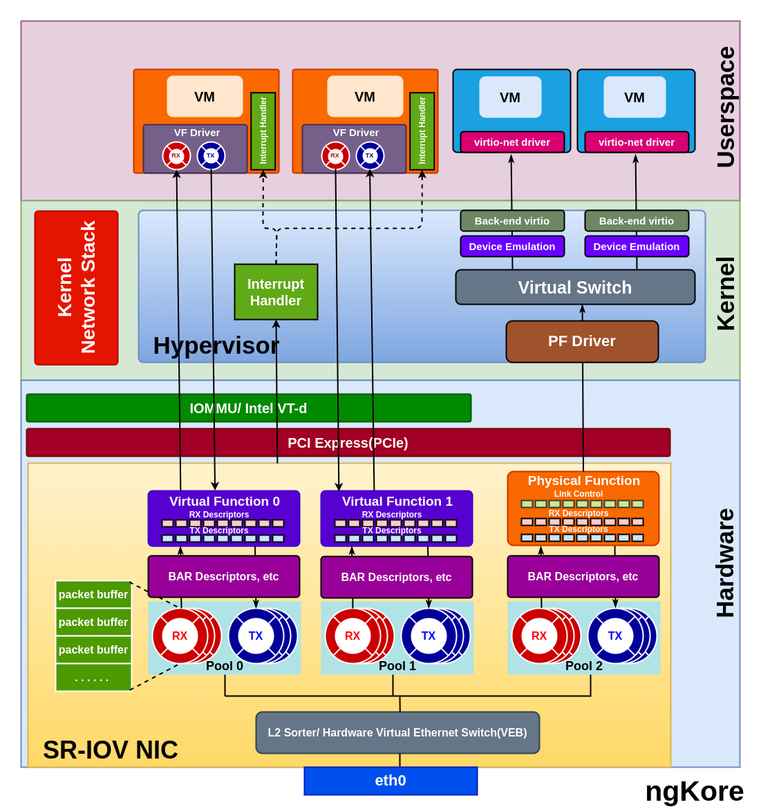

SR-IOV
****************

SR-IOV(*Single Root I/O Virtualization*) is a PCI feature that allows a PCIe device, such as a network adapter or a storage controller, to present itself as multiple, independent physical PCIe devices to VM or containers running on a host. 

In SR-IOV, the physical I/O device has one or more PFs(*Physical Functions*) and multiple VFs(*Virtual Functions*).

- **Physical Function** - It represents the primary functionality of the device that is used by the host operating system or the hypervisor for managing the device and its resources. The PF is a complete PCIe function with all the necessary resources, allowing it to configure and control the PCIe device. Additionally, the PF can easily transfer data to and from the device. The number of VFs created from a PF is limited based on the hardware capabilities.

- **Virtual Function** - VF is a lightweight instance of the PCIe device with a subset of its resources and functionality. VFs are very similar to the PFs but lack configuration resources, they can’t be treated like a fully featured PCIe device. Though they are given a unique PCI Express Requester ID(*RID*), hypervisor or OS support for SR-IOV is necessary to detect their incompetence as a complete PCIe device properly. They have the only ability to move the data in and out of themselves and they cannot be configured as this would change the underlying PF and thus all other VFs.

Hardware Requirements
==================

1. **SR-IOV-capable I/O device**: The physical I/O device, such as a network adapter or storage controller, must support SR-IOV.  It should have the necessary hardware capabilities to create and manage multiple Physical Functions (*PFs*) and Virtual Functions (*VFs*).

2. **System BIOS support**: The motherboard's BIOS should support SR-IOV, and it may need to be configured to enable this feature. 

3. **CPU with virtualization features**: The processor should support hardware virtualization technologies, such as Intel VT-d(*Virtualization Technology for Directed I/O*) or AMD-Vi(*AMD Virtualization - I/O Memory Management Unit*). These technologies enable direct access to hardware resources for virtual machines, which is crucial for SR-IOV to function correctly.

Packet Flow
=======

**From NIC to the VM/Container**
----------------------

1. Packets arriving at the NIC are temporarily stored in the internal memory of the NIC which is further sorted/classified by the  L2 sorter/Switch Classifier based on destination MAC addresses, VLAN tags, or other header information, and identify the appropriate VF to receive the packet.

2. The NIC creates the packet descriptors and placed them in the Rx queue from the pool of queues associated with the target VF. The packet descriptors in the RX queue point to the virtual memory address configured by the VF driver.

3. The VF handles the packet and triggers a DMA(*Direct Memory Access*) operation to transfer the packet data to the host memory. The DMA operation uses the addresses defined in the descriptors, which are virtual host addresses rather than physical host addresses.

4. The  IOMMU(*I/O Memory Management Unit*) or VT-d remaps the virtual host addresses to the corresponding physical host addresses, ensuring secure and isolated memory access for each VF. Now the packet is in the memory space of the VM/container.

5. The packet descriptors which point to the virtual host address are then transferred to the RX ring buffer of the VF driver.

6. Once the DMA is completed, the NIC generates an interrupt signal to indicate that a packet has been received. The hypervisor processes the interrupt and sends a virtual interrupt to the corresponding virtual machine, notifying it about the arrival of the packet. The same goes for the k8s environment but instead of hypervisor, the host operating system or container runtime will handle the interrupt.

**From VM/Container to the NIC**
----------------------

1. The VM/container prepares the packet for transmission and places it in the memory space of the VM.

2. The VM's VF driver creates packet descriptors containing the virtual host addresses of the packet data and adds them to the Tx ring buffer.

3. The VF driver within the VM initiates a DMA operation to transfer the packet data from the virtual memory address specified in the Tx ring buffer to the NIC.

4. The IOMMU or Intel VT-d, configured by the hypervisor, remaps the source DMA address from the virtual host address to a physical host address.

5. The DMA operation is completed, and the data packet is now in the host memory whose physical addresses are stored as descriptors in the Tx queue of the VF.

6. The data packets are then temporarily stored in the internal memory of the NIC, from where the Layer 2 sorter processes the packet, forwarding it based on the MAC address or VLAN information. This Layer 2 sorter is configured by the PF Driver.

7. The NIC receives the packet from the Layer 2 sorter and transmits it on the physical Ethernet link.