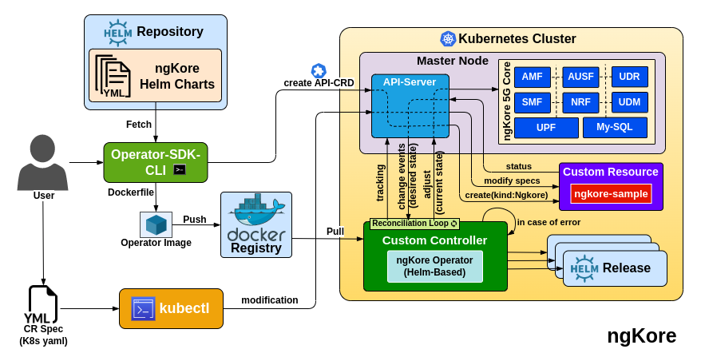
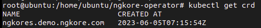
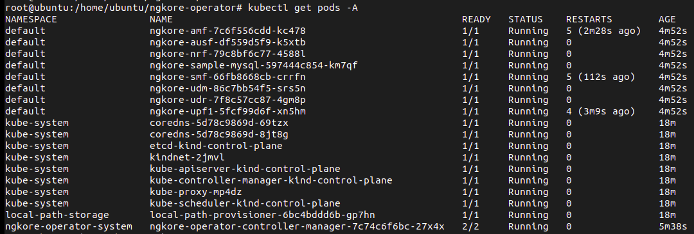
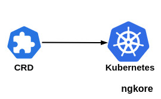
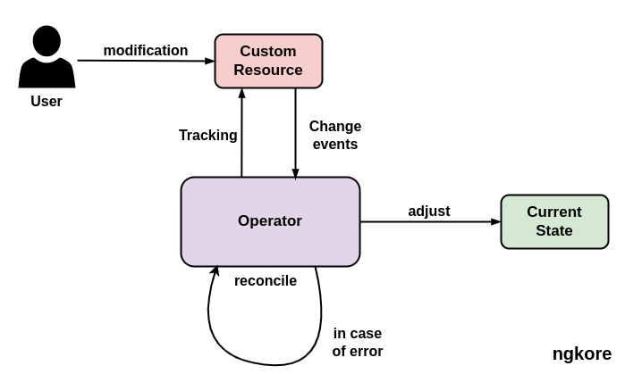

ngKore Operator
****************

1. **Creating the API and Controller** - We first create a new CRD(*Custom Resource Definition*) API and a new Controller. This is done using the Operator SDK. We provide a Helm chart path that the Operator will manage. This Helm chart, essentially, is the blueprint for deploying the application we want to manage.

2. **Fetching the Helm Chart** - The Operator SDK fetches this Helm chart from the repository during the API creation. The Helm chart is then stored locally in the Operator project.

3. **Building the Docker Image** - Once the API and Controller are set up, we build the ngKore Operator Docker image and then pushed to the Dockerhub registry so it can be accessed and pulled into a Kubernetes cluster.

4. **Applying the Operator's Deployment Manifest** - The Operator is now ready to be deployed to a Kubernetes cluster. We do this by applying the Operator's deployment manifest to the cluster using `kubectl`. The Operator is now running in the cluster.

5. **Creating Instances of the Custom Resource** - We can now start interacting with the Operator by creating instances of the **ngkore** custom resource. These instances are defined in YAML and are applied to the cluster using `kubectl`. This YAML defines the desired state of our application.

6. **Reconciliation Loop** - The Operator's controller constantly watches the ngkore custom resource for changes. If it detects a change, it performs the necessary actions to make the cluster reflect those changes. This is called the reconciliation loop.

7. **Modifying the Custom Resource** - The 'spec' field in the CR corresponds to the `values.yaml` file in the Helm chart. When a CR is created or modified, the Operator deploys or updates the Helm chart using the configuration values from the CR.

8. **Helm Releases** - Each time a CR is modified, a new release of the Helm chart is created with the updated configuration values. This release is a running instance of the chart and is stored in the cluster. This does not change the original Helm chart but instead creates a new instance (*release*) of the Helm chart with the updated configuration.

Operator
==================

Kubernetes Operators are software extensions to Kubernetes that make use of custom resources to manage applications and their components. They essentially automate the tasks of a human operator who would normally have to manage a service or set of services.

Operators follow the principles of the Kubernetes design, namely the Controller concept, which allows you to extend Kubernetes's functionality without modifying the code of Kubernetes itself.

Operators introduce new types of resources into Kubernetes, and these are defined using **CRDs**  . These new resources are application-specific and are understandable by the Operator; they contain the information that the Operator needs to manage the application.

The Operator includes a **Controller** which runs in a loop monitoring the state of your application. It compares the desired state (*defined by the custom resources*) with the actual state in the Kubernetes cluster. If the actual state does not match the desired state, the controller will execute the necessary steps to correct it.

Benefits of Operator
==================

1. **Automating Deployment and Scaling** - Operators can simplify the process of deploying 5G NFs and their associated resources on Kubernetes. It automates the creation of Pods, Services, ConfigMaps, and other Kubernetes resources required for 5G NFs. They can also handle the auto-scaling of these resources based on various parameters like network load.

2. **Managing Lifecycle** - Operators can manage the entire lifecycle of 5GNFs, including upgrades, rollbacks, and backup/restoration procedures. This can significantly simplify the management of 5G NFs and reduce the chance of human error during these processes.

3. **Handling Failures** - Operators can monitor the state of 5G NFs and their associated resources, and take corrective actions when something goes wrong. This might include restarting failed Pods or initiating failover to a backup instance in the case of a severe issue.

4. **Customization** - Since Operators extend the Kubernetes API with Custom Resources, they allow for deep customization of the managed software. This is especially useful in the context of 5G NFs, which can have complex configuration requirements.

5. **Observability** - Operators can expose the managed software's metrics, logs, and other observability features, thus simplifying the integration with monitoring and alerting systems.

6. **Integration** - Operators can integrate with other parts of the Kubernetes ecosystem, like service meshes, storage providers, security systems, etc.

Use of Operator
==================

1. **Automated NF Deployment** - With a 5G Operator, you can automate the deployment of various NFs such as UPF, AMF, SMF, AUSF, NRF, UDM, etc. This makes the deployment process more efficient, less error-prone, and more scalable.

2. **Lifecycle Management of NFs** - Operators are designed to manage the entire lifecycle of a resource. They can manage updates and upgrades of NFs, manage backups and restoration, and even handle decommissioning. This simplifies the day-to-day operations of 5G NF management.

3. **Auto-Scaling and Load Balancing** - Depending on network traffic and resource utilization, Operators can automate the process of scaling the 5G network functions in or out. This ensures optimal utilization of resources and maintains high availability of services.

4. **Network Slicing** - Operators can help automate the process of creating network slices. Each network slice is an isolated end-to-end network tailored to fulfill specific requirements. By automating this process, Operators can make it easy to deploy and manage multiple network slices for different use cases.

5. **Handling Failures and Fault Management** - Operators constantly monitor the state of the resources they manage and can take automatic actions to handle failures. They can restart failed pods, recreate services, or even trigger failover mechanisms to maintain network service continuity.

6. **Integration and Interoperability** - Operators can play a key role in ensuring interoperability of 5G network functions from different vendors by standardizing the deployment and management interfaces.

7. **Automated Configuration Management** - Operators can manage complex configuration changes across multiple NFs, ensuring that changes are rolled out consistently and safely.

8. **Service Assurance** - Operators can provide real-time monitoring and diagnostics of 5G NFs, allowing for proactive maintenance and fault detection.

By taking advantage of Operators, telecommunication providers can simplify and automate many of the complex tasks involved in managing 5G NFs. This leads to increased operational efficiency, reduced operational costs, and improved service reliability.

CRD
==================

It stands for Custom Resource Definition. Kubernetes comes with several pre-defined resources like Pods, Services, and Deployments that we can create and manage. However, sometimes we might need to add new types of resources that are specific to our application or infrastructure. That's where CRDs come in.

A CRD allows us to create our own, custom resources that behave like native Kubernetes resources. Once a CRD is created, users can create and manage instances of this new resource using `kubectl`, just like they would for built-in resources.
CRDs are powerful because they let us extend the Kubernetes API to fit our needs, while still benefiting from the Kubernetes API's infrastructure, like its RESTful design, CLI and UI integration, and lifecycle management.

CR
==================

A CR(*Custom Resource*) is an extension of the Kubernetes API that allows to store and retrieve structured data. It's a way to introduce our own API objects into our Kubernetes cluster to suit our application's specific needs.

When we create a  CRD(*Custom Resource Definition*), we create a new kind of resource in our Kubernetes cluster. This new resource behaves like any standard resource in Kubernetes (*like Pods or Services*), meaning we can use `kubectl` to create, view, modify, and delete instances of our custom resource.

Importance of CRD and CR
==================

CRDs and CRs in Kubernetes can play a pivotal role in the deployment and management of 5G networks. 

1. **Network Functions Virtualization (NFV)**: 5G networks heavily rely on NFV, which involves running NFs as software on standard hardware. Kubernetes is an excellent platform for running these VNFs. CRDs can be used to define new types of resources for different VNFs, and CRs can then be created as instances of these new resource types. This allows for the easy deployment, scaling, and management of NFs, which is critical in a 5G context.

2. **Service Meshes and Traffic Management**: Service meshes can be used to manage traffic between VNFs, providing features like load balancing, traffic routing, and security. These service meshes often use CRDs to define new types of resources for managing these features, and CRs can then be created to implement specific traffic management rules. This is particularly important in 5G networks, which need to handle a high volume of traffic and ensure that it's routed efficiently.

3. **Custom Scheduling and Resource Allocation**: Different VNFs may have different resource requirements, and may need to be scheduled on specific nodes to meet these requirements. CRDs can be used to define new types of resources that specify these scheduling requirements, and CRs can then be created to specify the requirements for each VNF. This is crucial in 5G networks, which need to ensure that resources are allocated efficiently to handle the high data rates and low latencies that 5G promises.

4. **Network Slicing**: One of the key features of 5G is network slicing, which allows for the creation of multiple virtual networks that operate on the same physical infrastructure. CRDs can be used to define new types of resources for these network slices, and CRs can then be created for each slice in our network. This is important in 5G networks, which need to support a wide range of different services, each with its own requirements.

In summary, CRDs and CRs provide the flexibility and extensibility needed to manage the complex and diverse needs of 5G networks. They allow us to define and manage custom resources that represent the various components and features of a 5G network, extending the functionality of the Kubernetes API to better suit the specific needs of 5G.
